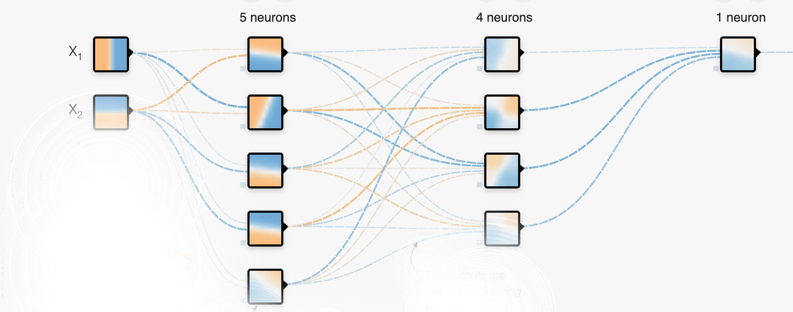
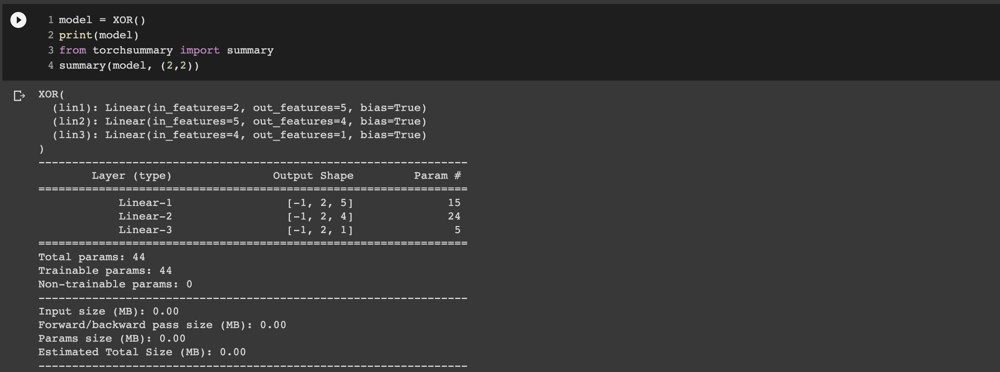
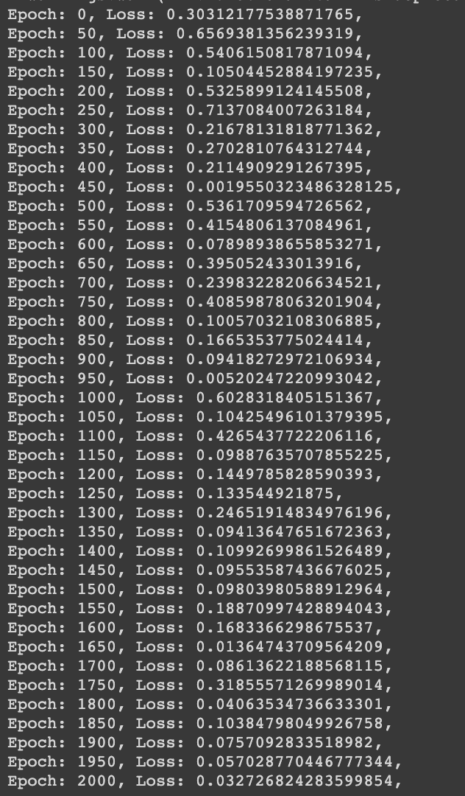

## Assignment1

**Task 1 :**

Rewrite the Colab file and:
1. remove the last activation function
2. make sure there are in total 44 parameters
3. run it for 2001 epochs

For this we added an additional linear layer. Also we changed the no. of neurons in each layer, in the first layer we used  5 neurons, second layer 4. Also we removed the last activation funation
Total number of parmeter = 44
* Input to Layer1 ---> 2 * 5 (weights) + 5 (biases) 
* Layer1 to Layer2 ---> 5 * 4 (weights) + 4 (biases) 
* Layer2 to Output ---> 4 * 1 (weights) + 1 (biases) 


**Output** : 
 1. Parameters: 

 
 
 2. Training :

 
 

**Task 2 :**

### 1. **What is a neural network neuron?**
 Neurons in deep learning were inspired by neurons in the human brain.Groups of neurons work together inside the human brain to perform the functionality that we require in our day-to-day lives. One important observation was that a neuron by itself is useless. Instead, we require networks of neurons to generate any meaningful functionality. This is because neurons function by receiving and sending signals. More specifically, the neuron’s dendrites receive signals and pass along those signals through the axon. The dendrites of one neuron are connected to the axon of another neuron. These connections are called synapses, which is a concept that has been generalized to the field of deep learning.
<p align="center">
  
</p>
Neurons in deep learning models are nodes through which data and computations flow. They receive one or more input signals. These input signals can come from either the raw data set or from neurons positioned at a previous layer of the neural net.They perform some calculations.They send some output signals to neurons deeper in the neural net through a synapse.
Here is a diagram of the functionality of a neuron in a deep learning neural net:


As you can see, neurons in a deep learning model are capable of having synapses that connect to more than one neuron in the preceding layer. Each synapse has an associated weight, which impacts the preceding neuron’s importance in the overall neural network.

Weights are a very important topic in the field of deep learning because adjusting a model’s weights is the primary way through which deep learning models are trained. Once a neuron receives its inputs from the neurons in the preceding layer of the model, it adds up each signal multiplied by its corresponding weight and passes them on to an activation function, which adds  a non linearity to the signal.

### 2. **What is the use of the learning rate?**
The amount that the weights are updated during training is referred to as the step size or the “learning rate.” Specifically, the learning rate is a configurable hyperparameter used in the training of neural networks that has a small positive value, often in the range between 0.0 and 1.0.

The learning rate controls how quickly the model is adapted to the problem. Smaller learning rates require more training epochs given the smaller changes made to the weights each update, whereas larger learning rates result in rapid changes and require fewer training epochs.A learning rate that is too large can cause the model to converge too quickly to a suboptimal solution, whereas a learning rate that is too small can cause the process to get stuck.

The challenge of training deep learning neural networks involves carefully selecting the learning rate. It may be the most important hyperparameter for the model.

### 3. **How are weights initialized?**
 Before we look at different ways of kernel initialization, let’s understand the criticality of initialization,<br/>
> “… if you are sloppy with the weight initialization, these non-linearities can “saturate” and entirely stop learning — your training loss will be flat and refuse to go down” – Andrej Karpathy <br/>

The aim of weight initialization is to prevent layer activation outputs from exploding or vanishing during the course of a forward pass through a deep neural network. If either occurs, loss gradients will either be too large or too small to flow backwards beneficially, and the network will take longer to converge if it is even able to do so at all. 

Generally, there are four ways to initialize the weights before we start training our neural network.
  1. Zero initialization
  2. Random initialization
  3. Xavier Initialization
  4. He-et-al initialization

Any initialization that prevents the gradients of the network’s activations from vanishing or exploding, is the desirable initialization. The below conditions should satisfy, 
* The mean of the activations should be zero. High magnitudes will cause an explosion in gradients. 
* The variance of the activations should stay the same across every layer. This will enable good gradient flow.


1. Zero Initialization <br>
Set all the weights to zero. In this case, all the kernels will output the same feature and no further learning happens. If all the weights are initialized to zeros, the derivatives will remain same for every w in W[l]. As a result, neurons will learn same features in each iterations. This problem is known as network failing to break symmetry. And not only zero, any constant initialization will produce a poor result.

2. Random Initialization <br>
The weights are initialized very close to zero, but randomly. <br>
```W = np.random.randn(layer_size(l), layer_size(l-1))*0.01```

3. Xavier Initialization <br>
The kernel weights are initialized keeping in mind the size of the previous layer. The weights are still random but differ in range depending on the size of the previous layer of neurons <br>
```W=np.random.randn(layer_size[l], layer_size[l-1]) * np.sqrt (1 / layer_size[l-1] )```

4. He-et-al initialization <br>
This method of initializing became famous through a paper submitted in 2015 by He et al, and is similar to Xavier initialization, with the factor multiplied by two. This helps in attaining a global minimum of the cost function faster and more efficiently <br>
```W=np.random.randn(layer_size[l],layer_size[l-1])*np.sqrt(2/layer_size[l-1])```


### 4. **What is "loss" in a neural network?**
Loss is a method of evaluating “how well the neural network models the dataset”. If the model's predictions are totally off, the loss function will output a higher number. If they’re pretty good, it’ll output a lower number. As you train the neural network further to try and improve the model, the loss function will tell you if it's improving or not.<br>
<p align="center">
  
</p>
 The optimization strategies aim at “minimizing the loss value”. Neural networks are trained using stochastic gradient descent(optimisation strategy). There are many loss functions to choose from, depending on the problem and data itself. Some exaples are: <br>
  1. Mean Squared Error (MSE) : This type of loss may be used in something like a regression problem where you predict a real-value quantity. The output for this is usually a single node with a linear activation unit<br>
  2.Cross-Entropy: This type of loss may be used in something like a Binary Classification Problem, where you classify an example(image or text) as belonging to one of two classes. The problem is usually framed as predicting the likelihood of an example belonging to class one, e.g. the class that you assign the integer value 1, whereas the other class is assigned the value 0.Can be acheived by having output as a node with a sigmoid activation unit.Cross Entropy loss is also referred to as Logarithmic loss.

### 5. **What is the "chain rule" in gradient flow?**

In neural networks, during back propogation, we update the weights using an optimization strategy know as stochastic gradient descent(SGD). For this we calculate the partial derivate of the loss wrt each parameter. As neural networks consist of many layers, and each layer is a function of outputs from the previous layer, in order to calculate the partial derivate of these composite functions we use chain rule.

<p align="center">
  
</p>


The chain rule is a helpful technique to calculate the derivative of nested functions. For example we had a function like this one and we want to calculate it's derivative wrt x,f(x) = log(1+sin(x)) . This function is a composition of the function, g of h, that is the logarithm of h, and the function, h equals two plus the sine of x. So f(x) is really a function, g, of a function, h, of x. We can calculate the derivative of h with respect to x by applying the chain rule. 

So to calculate this first, we calculate the derivative of h with respect to x, and then we calculate the derivative of g with respect to h. Finally, we multiply the two. g of h is a logarithm function, so the derivative is equal to 1/g(x). h of x is two plus sin(x), and, hence it's derivative is cos(x) So, finally, the derivative of our nested function, f(x), is the product of the two derivatives, (1/(2+ sin(x))) * cos(x)
