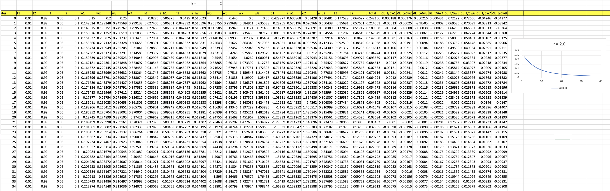

# Assignment 2

# Steps : 

* h1 = w1\*i1 + w2\*i2

* h2 = w3\*i1 + w4\*i2

* a_h1 = sigmoid(h1)

* a_h2 = sigmoid(h2)

* o1 = w5\*a_h1 + w6\*a_h2 

* o2 = w7\*a_h1 + w8\*a_h2

* a_o1 = sigmoid(o1)

* a_o2 = sigmoid(o2)

* E1 = 1/2\*(t1-a_o1)^2

* E2 = 1/2\*(t2-a_o2)^2

* E_total = E1 + E2

* sigmoid(x)  = 1/(1+exp(-x))

## Gradient calculations(step by step in excel file)

### Gradient of E_total wrt w5,w6,w7 and w8(Layer 2 Weights)
* ðE_t/ðw5 = (a_o1-t1) \* (a_o1 \*(1-a_01)) \* a_h1

* ðE_t/ðw6 = (a_o1-t1) \* (a_o1 \*(1-a_01)) \* a_h2

* ðE_t/ðw7 = (a_o2-t2) \* (a_o2 \*(1-a_02)) \* a_h1

* ðE_t/ðw7 = (a_o2-t2) \* (a_o2 \*(1-a_02)) \* a_h2

### Gradient of E_total wrt a_h1 and a_h2(Layer 1 activations)
* ðE_t/ða_h1 = ((a_o1-t1)\*(a_o1\*(1-a_o1))\*w5) + ((a_o2-t2)\*(a_o2\*(1-a_o2))\*w7)

* ðE_t/ða_h2 = ((a_o1-t1)\*(a_o1\*(1-a_o1))\*w6) + ((a_o2-t2)\*(a_o2\*(1-a_o2))\*w8)

### Gradient of E_total wrt w1,w2,w3 and w4(Layer 1 Weights)
* ðE_t/ðw1 = (((a_o1-t1)\*(a_o1\*(1-a_o1))\*w5) + ((a_o2-t2)\*(a_o2\*(1-a_o2))\*w7)) \* a_h1\*(1-a_h1) \* i1

* ðE_t/ðw2 = (((a_o1-t1)\*(a_o1\*(1-a_o1))\*w5) + ((a_o2-t2)\*(a_o2\*(1-a_o2))\*w7)) \* a_h1\*(1-a_h1) \* i2

* ðE_t/ðw3 = (((a_o1-t1)\*(a_o1\*(1-a_o1))\*w6) + ((a_o2-t2)\*(a_o2\*(1-a_o2))\*w8)) \* a_h2\*(1-a_h2) \* i1 

* ðE_t/ðw4 = (((a_o1-t1)\*(a_o1\*(1-a_o1))\*w6) + ((a_o2-t2)\*(a_o2\*(1-a_o2))\*w8)) \* a_h2\*(1-a_h2) \* i2 

## Results 
### 1. lr = 0.1
**Weights and Gradients**

**Loss Plot**

### 2. lr = 0.2
**Weights and Gradients**

**Loss Plot**

### 3. lr = 0.5
**Weights and Gradients**

**Loss Plot**

### 4. lr = 0.8
**Weights and Gradients**

**Loss Plot**

### 5. lr = 1.0
**Weights and Gradients**

**Loss Plot**

### 6. lr = 2.0
**Weights and Gradients**

**Loss Plot**

